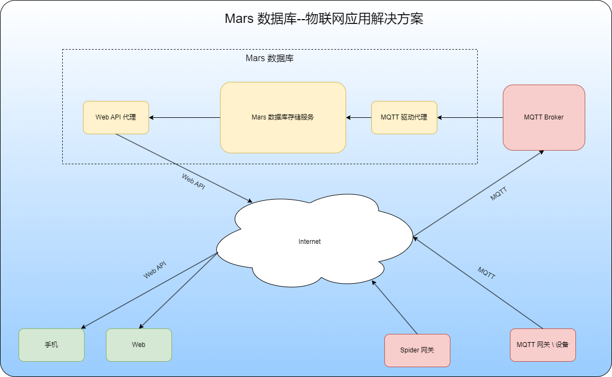

 **物联网四板斧：[Mars 实时库](https://github.com/cdy816/mars) 、设备采集平台[Spider](https://github.com/cdy816/Spider) 、跨平台界面解决方案[Chameleon](https://github.com/cdy816/Chameleon)、数据分析报警引擎[Ant](https://github.com/cdy816/Ant)**
  
  
<!--[![Contributors][contributors-shield]][contributors-url]
[![Forks][forks-shield]][forks-url]
[![Stargazers][stars-shield]][stars-url]
[![Issues][issues-shield]][issues-url]
[![Apache License][license-shield]][license-url]
 

-->
<!-- PROJECT LOGO -->

 

  <h2 align="center">Mars 实时库</h2>
 
  

    高性能、跨平台实时库!        
     
  

# mars/火星实时物联数据库

 Mars 数据库是一个集数据**采集**、**存储**、**分析**为一体的实时数据库。通过简单的可视化的配置，即可实现将工业现场的各种传感器接入、并进行记录或者进行数据逻辑处理、以及提供其他程序使用。
 Mars 数据库具有较高的性能，单机支持120万个传感器信号接入；Mars 2.0 分布式版本通过多机联网组成的集群，可以实现上千万的信号的接入。
 

## 功能

  Mars 数据库整个分成开发、运行2个部分，两者之间相互独立。数据库的开发用于管理数据库支持的变量、安全信息、接口信息等；数据库的运行负责数据的采集、存储、对外提供实时、历史数据服务。
  
  数据库开发支持分布式、多客户端、多数据库开发；开发客户端目前仅支持在Windows下运行的桌面客户端；服务器则是跨平台的，对外提供GRPC、Web API接口，方便第三方进行扩展接入。
  
  数据库运行支持跨平台、多种类型数据访问接口。支持有Web API、GRPC、自定义私有协议接口、OPC UA。数据库运行时采用数据库核心服务和API接口独立分开的多进程设计，API 服务和数据库核心功能可以在一台机器上也可以分别在不同的机器上；同时运行有多中类型的API接口、同一个种多个API接口同时运行，以支持多种、多个类型的客户端同时访问。
  
  数据库运行时不支持直接添加、删除、修改变量，但支持数据库的热启动（即在不退出重启的情况下，可以动态加载生效数据库库开发时新增、修改的变量，不支持删除的变量动态生效）。
  
  历史数据存储支持**无损压缩**、**死区压缩**、**斜率死区压缩（旋转门算法）** 3种压缩方式，同时支持**数据补录**功能（配合设备驱动实现当网络中断、又恢复后历史数据补录的功能）。
  
  历史数据支持定时导出功能，由于采用独立的文件存储设计，历史数据的导入，只要将相应的文件拷贝到历史存储目录即可。
  
  数据库支持双机冗余热备功能，历史数据路径存储到第三方的物理磁盘上，实时数据支持实时数据同步。

## 应用方案
Mars数据库可以在不同的场景下使用，作为纯后端库的实时库模式、作为SCADA系统一部分的变量库模式，基于物联网的应用模式等。如下图：

## 接口
1. 基于消费端的上接口。基于**Web API**、**Grpc**、**OPC-UA**、**私有协议高速接口**等。
2. 基于数据采集端的下接口 [Spider ](https://gitee.com/chongdaoyang/Spider)、第三方采集程序直接访问接口(DirectAccess)(Grpc,MQTT)

## 关联项目
1. 数据采集平台 [Spider ](https://gitee.com/chongdaoyang/Spider)
2. 数据报警分析平台 [Ant ](https://gitee.com/chongdaoyang/Ant)

## 运行环境
系统采用.net 6 平台开发,依赖于.net 6 的**跨平台**性，可部署在window、Linux等操作系统中,也可以部署在Docker中。 

## 开始使用

### 安装

 1. 安装.net 运行环境 [参考微软官方文档](https://dotnet.microsoft.com/download/dotnet/6.0)
 2. 数据库安装。下载Mars 发部版本，将软件包解压到特定目录。

## 帮助文档、接口开发文档
1. [文档](https://github.com/cdy816/mars/tree/master/Doc)([Gitee地址](https://gitee.com/chongdaoyang/mars/tree/master/Doc))
2. [Mar数据库应用结构](https://my.oschina.net/u/3520380/blog/4288058)

## 版本
[1.0 版本](https://gitee.com/chongdaoyang/mars/releases/tag/V1.0)

## 路线图
项目分成2个阶段：单机、分布式。

1. 2023年10月份开始分布式版本的开发，预计2026年10月份能够推出分布式版本的2.0。分布式版本通过计算机集群、多级协作的方式，来实现更大规模、变化更加快速的传感器数据的接入。

## 沟通交流

1. 技术 QQ 群:950906131
2. 开发者贡献群:601418190
3. Email:cdy816@hotmail.com

## 友情链接

[IOT 采集平台](https://gitee.com/pnoker/iot-dc3)

## 合作伙伴

非常欢迎你的加入！提一个 [Issue](https://github.com/cdy816/mars/issues)  或者提交一个 Pull Request。

感谢以下人员、公司的参与：

  **宁波德沛数据**
  **lin**
  **湖南大驰科技**  

<!-- MARKDOWN LINKS & IMAGES -->
<!-- https://www.markdownguide.org/basic-syntax/#reference-style-links -->
[contributors-shield]: https://img.shields.io/github/contributors/cdy816/mars.svg?style=for-the-badge
[contributors-url]: https://github.com/cdy816/mars/graphs/contributors
[forks-shield]: https://img.shields.io/github/forks/cdy816/mars.svg?style=for-the-badge
[forks-url]:https://github.com/cdy816/mars/network/members
[stars-shield]: https://img.shields.io/github/stars/cdy816/mars.svg?style=for-the-badge
[stars-url]:https://github.com/cdy816/mars/stargazers
[issues-shield]: https://img.shields.io/github/issues/cdy816/mars.svg?style=for-the-badge
[issues-url]:https://github.com/cdy816/mars/issues
[license-shield]: https://img.shields.io/github/license/cdy816/mars.svg?style=for-the-badge
[license-url]: https://github.com/cdy816/mars/blob/master/LICENSE
[product-screenshot]:https://github.com/cdy816/mars/blob/master/Doc/Images/DbInStudio.png
